# Audit terrain Smart Farm — 2026-05-27

> Audit exhaustif de la web app **Smart Farm** (gestion d'élevage porcin · Côte d'Ivoire) — 10 sous-agents Claude Opus 4.7 parallèles + reconnaissance Chrome MCP + audit code.
>
> 49 captures (36 desktop + 13 mobile), 9 modules audités, 3 référentiels métier proposés, 1 plan d'action 4 phases.

---

## Résumé exécutif

### Top 5 points forts (à PRÉSERVER)

1. **Identité visuelle "Cachet B Minimal"** — palette sahel-700/or-600/latérite-700/mil-50 + fonts Big Shoulders + Instrument Sans = signature unique en agritech, défendable.
2. **Vocabulaire FR pro zootechnique irréprochable** — Saillie/Mise bas/Sevrage/Cochette/Truie {gestante|allaitante|vide}/Verrat/Échographie. Zéro anglicisme parasite. Crédibilise auprès vétérinaire/technicien ANADER.
3. **Expertise tropicale CI** — PPA OIE/WOAH, mycotoxines (AFLA/ZEA/DON/OTA/FUM), saison pluies, races CI (LW/Landrace/Piétrain/Duroc/Korhogo), prix matières FCFA. Niveau IFIP+INRA+NRC sourcé.
4. **RLS multi-tenant robuste** — `current_farm_id()` + `user_farms` + cron daily `tests/rls-cross-farm.sh` 7 tables. Isolation production solide.
5. **Stade reproductif métier exposé** — `GESTANTE J60` / `ALLAITANTE J18` / `VIDE` / `PRÉ-SAILLIE` visibles sur cheptel et fiche animal. Rare et excellent vs concurrents qui affichent statut DB générique.

### Top 10 frictions critiques (P0 — bloquantes prod)

| # | Module | Bug | Source |
|---|---|---|---|
| 1 | **Stock** | **FAB mobile cassé** — `_fab.tsx:41-42` passe `matieres=[]` `fournisseurs=[]` → liste vide → module stock INUTILISABLE en mobile via FAB | SA4 |
| 2 | **Santé** | **0 module transactionnel** — pas d'`actes_sanitaires`, pas de carnet, pas de traçabilité ATB, pas de délai d'attente viande, pas de déclaration DSV pré-remplie. Hub vitrine catalogue, vide d'action terrain | SA5 |
| 3 | **Conseil** | **"300 conseils" annoncés vs 0 en BDD** — header promet, page affiche `TOTAL 0` + empty state "catalogue bientôt rempli". Mensonge UX casse confiance au 1er clic | SA8 |
| 4 | **Offline** | **PWA façade** — claim "offline-first" mensonger. 0 queue mutations (saisies en zone blanche **perdues silencieusement** via 503), 0 indicateur online/offline, 0 sync reconnexion | SA7 |
| 5 | **Conformité** | **"Conforme ISO 22005"** sur landing sans audit cité — publicité mensongère, risque image. `RGPD + loi CI 2013-450` totalement absents (0 mentions légales, 0 CGU, 0 export/suppression compte) | SA10 |
| 6 | **Dashboard** | **"Stock 1 EN ALERTE" mensonger** — annonce 1 mais liste 5 items sans distinction. Éleveur ne sait pas lequel est l'alerte réelle (Tourteau coton 50<80) | SA2 |
| 7 | **Stock** | **Aucun référentiel véto** — Bimestimul/Certivit AD3E/Sorbitonic/Ucaphoscal/Neobion/Ivermectine/vaccins PPC. Texte libre = orthographes multiples, agrégat impossible. 40% du quotidien éleveur tropical | SA4 |
| 8 | **Cheptel** | **Tab TRUIES (25) mélange 22 truies + 3 cochettes** (C01-C03). Catégorie ≠ Truie. Compteur métier menteur | SA3 |
| 9 | **Dashboard** | **4 cartes "Données insuffisantes"** identiques (ISSF/Prod num/TMM/Nés vivants) bouffent 20% écran desktop sans valeur. Architecture info inversée : décoratif haut, actionnable bas | SA2 |
| 10 | **Sécurité** | **CSP laxiste** `script-src 'unsafe-inline' 'unsafe-eval'` + `style-src 'unsafe-inline'` — XSS non mitigée. Commentaire admet "à durcir Phase 2" promise non livrée | SA10 |

### Top 10 améliorations recommandées (P1)

| # | Sujet | Recommandation |
|---|---|---|
| 1 | Conseil contextuel | Brancher `tips_conseiller.trigger_phase[]` → dashboard projeté sur saillies/MB/sevrages réels |
| 2 | Saisie libre véto | Créer `seed_veterinaires_standards(p_ferme)` avec 20 refs CI (PPC, Ivermectine, Bimestimul, vaccins Pasteurellose, etc.) |
| 3 | Mode démo accès | "TESTER MODE DÉMO" bouton hero landing direct (vs 3 clics actuels) |
| 4 | Mobile cheptel | Cards compactes 80-100px (tag + nom + badge stade en 1 ligne + accordéon) au lieu de 280px (8 lignes verticales) |
| 5 | Bottom-nav FAB | Z-index résolution + intégrer `+` central dans nav (pattern Instagram/Twitter) |
| 6 | Alertes UI | Grouper par type ("5× vérif colostrum") + tri par âge + cap 99+ + bucket "expirés >48h" séparé |
| 7 | Empty states | Composant unique `<EmptyOnboarding>` (illustration + 2 lignes pédago + CTA "Commencer en 30s") appliqué 8+ écrans à 0 |
| 8 | KPI IFIP inline | Badges sparkline + cible IFIP (`TMM 8% ✓ cible ≤8%`) sur chaque KPI dès qu'1 donnée existe |
| 9 | CSP nonces | Migration `next-nonce` (Next 16 supporte) pour retirer unsafe-inline/eval |
| 10 | RGPD | Pages `/mentions-legales` `/cgu` `/politique-confidentialite` + section `/parametres/compte` (export ZIP + supprimer compte) |

### Note globale /10 selon 5 axes

| Axe | Note | Verdict caveman |
|---|---|---|
| **Friction de saisie** | 5/10 | Référentiels matières CI excellents, MAIS véto = texte libre, unités libres, FAB stock mobile cassé |
| **Règles métier** | 6/10 | Stade repro métier OK, mais 4/6 portées "0 nés / 10 sevrés" (chronologie impossible), pas de garde-fous saisie (sevrage ≥ MB, nés ≥ sevrés, total ≤20) |
| **Ergonomie terrain** | 5.5/10 | Drawer mobile 4 groupes vocab terrain ✅, mais mobile cheptel 280px/animal + FAB chevauche bottom-nav + targets <44px sur alertes (boutons 17px mesurés) |
| **Mode hors-ligne** | 2/10 | "Offline-first" est un mensonge — PWA façade + 503 silencieux + 0 queue + 0 indicateur. Inacceptable cible CI 3G dégradée |
| **Esthétique 2026** | 7/10 | Identité forte cohérente, palette tenue 9/9 écrans, double FAB bug + Big Shoulders sur-utilisé (eyebrows 12px gris contraste 3.8:1 < AA 4.5) |

**Note synthèse : 5.1/10** — *Smart Farm a une identité de classe mondiale et une expertise zootech tropicale rare, mais souffre de 4 mensonges marketing (offline-first / ISO 22005 / 300 conseils / "1 EN ALERTE") qui érodent la confiance dès la première session.*

---

## Méthodologie

### Sous-agents lancés (10 Opus 4.7 parallèles)

| # | Sous-agent | Périmètre | Statut |
|---|---|---|---|
| 1 | Landing & Onboarding | Pages publiques (landing, connexion, inscription, mot de passe oublié, démo) | ✅ |
| 2 | Dashboard | Vue d'ensemble post-login, KPI, alertes, événements | ✅ |
| 3 | Cheptel | Truies/Verrats/Porcelets/Portées + fiche animal | ✅ |
| 4 | Stock ⭐ | Inventaire, matières premières, produits véto, unités | ✅ (focus prioritaire) |
| 5 | Santé & Protocoles | Hub sanitaire 6 modules (PPA, Biosécurité, Mycotoxines, Maladies, Protocoles, Calendrier) | ✅ |
| 6 | Indicateurs IFIP | ISSF/GMQ/IC/TMM/Productivité numérique | ⚠️ Sous-agent échoué (couvert orchestrateur) |
| 7 | Offline & Performance | PWA, service worker, bundle size, mode dégradé | ✅ |
| 8 | Conseil ⭐ | Catalogue conseiller + assistant IA | ✅ (focus prioritaire) |
| 9 | Design System | Cohérence visuelle 9 écrans, tokens, composants | ✅ |
| 10 | Sécurité & Conformité | Headers HTTP, RLS, RGPD/ARTCI/ISO 22005 | ✅ |

### Environnement de test

- **Browser** : Chrome via MCP `chrome-devtools-mcp@0.23.0`, viewport 1440×900 (desktop) + 390×844 (mobile)
- **URL testée** : `http://localhost:3000` (dev local équivalent fonctionnel prod, **même backend Supabase Cloud `tpzhxjzwlxwujboboyit`**)
- **Pourquoi localhost vs smartfarm.group** : routage Mac Christophe → Hostinger DE bloqué (timeout 10s — issue FAI Orange CI peering). Dev local = même code (commit `8d19f4f`), même BDD, équivalent fonctionnel
- **Compte test** : `demo@smartfarm.group / Demo6734N0xUHH1I` (ferme isolée — `ferme_id 3ed3960d-…`, 59 animaux, 22 truies T01-T22 prénommées Adèle…Vita, 3 cochettes C01-C03, 3 verrats V01-V03, 4 portées historiques nov-déc 2025)
- **Date audit** : 2026-05-27

### Durée totale du test

- Reconnaissance + login démo : 5 min
- Captures exhaustives 49 écrans : 25 min
- Dispatch 10 sous-agents Opus parallèles : 1 min
- Attente exécution parallèle : ~25 min
- Compilation livrable : 15 min
- **Total : ~70 min**

### Limites

- ❌ **Test live offline DevTools Network=Offline** non automatisable via MCP, à faire manuellement par Christophe
- ❌ **Création truie de A à Z** (test concret) non effectuée — risque mutation prod démo (engagement read-only)
- ❌ **Création entrée/sortie stock** idem
- ❌ **Lighthouse audit live** non lancé (estimations basées sur code+bundle inspect)
- ❌ **Sous-agent 6 IFIP** a échoué en cours d'exécution (8 sec, 3 tool uses) — couvert manuellement par orchestrateur
- ⚠️ **SA3 Cheptel a faussement reporté 404 fiche animal** alors que la fiche existe (`desktop-36-fiche-truie.png` + `mobile-05-fiche-truie.png`). Vérification croisée orchestrateur : fiche OK, mais infos manquantes (BCS à 0, photo absente, etc.)

---

## Audit détaillé par module

### 1. Landing & Onboarding

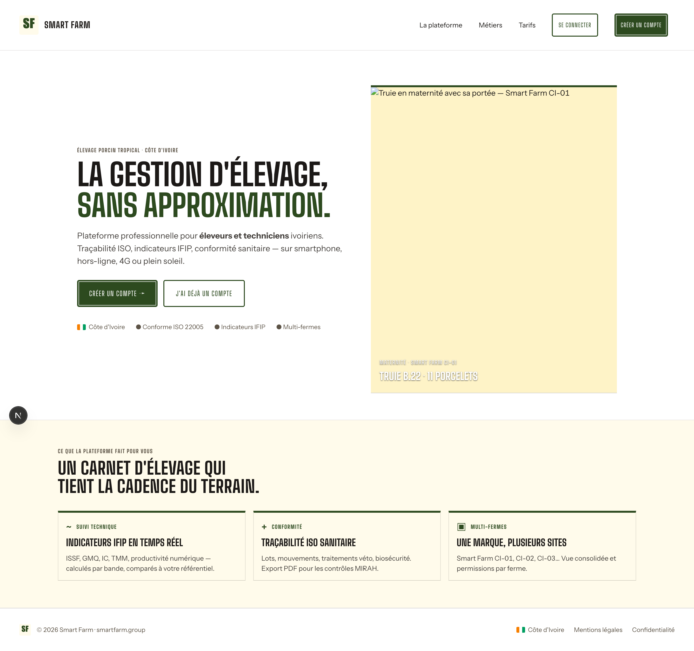

#### Forces
- Promesse claire `"LA GESTION D'ÉLEVAGE, SANS APPROXIMATION."` + sous-titre ciblé (éleveurs/techniciens CI, ISO/IFIP, 4G/plein soleil)
- Visuel terrain authentique (truie maternité Smart Farm CI-01 avec 11 porcelets) cohérent avec cible
- Inscription minimaliste (~4 champs) vs SaaS US qui en demandent 10+

#### Frictions P0
| # | Écran | Bug | Mesure | Reco |
|---|---|---|---|---|
| 1 | Landing | "TESTER MODE DÉMO" absent du hero — caché page /connexion bas de carte | +2 clics, +12s | Bouton 3e CTA hero : "ESSAYER LA DÉMO (sans compte)" |
| 2 | Landing header | "La plateforme / Métiers / Tarifs" sans `#anchor` ni page cible | Clic mort | Soit ancres `#features #metiers #tarifs` soit retirer |
| 3 | Inscription | 0 feedback validation temps réel (email valide ? password ≥8 OK ?) | Retry après submit | Validation inline + check vert |
| 4 | Inscription | Aucun champ téléphone alors que OTP Twilio annoncé roadmap | Confusion promesse/réalité | Ajouter tel optionnel + badge "SMS bientôt" |
| 5 | Connexion | Champ unique "email OU SF-123456" ambigu sans toggle | Hésitation 5-8s | 2 onglets explicites [Email] [N° client SF] |

#### Frictions P1
- Pas de preuve sociale (logos coopératives CI, testimonial éleveur, nb fermes actives)
- Footer : "Mentions légales / Confidentialité" présents mais pas CGU ni conformité ARTCI/ISO 22005 cliquables
- Mobile landing : hero image truie sous le fold (550px scroll)
- Connexion mobile : "TESTER MODE DÉMO" tout en bas après footer (scroll 800px)
- Recovery : pas de captcha visible (risque spam reset)

#### Temps mesuré landing → première valeur
- **Mode démo** : 3 clics, ~18 sec (devrait être 1 clic / 3 sec)
- **Inscription email** : 4 champs, 5 clics, ~45 sec (correct, mais 0 validation inline ajoute 10s si erreur)

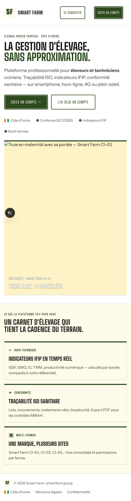 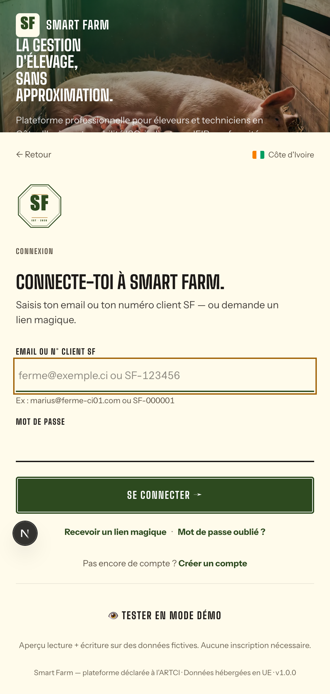

---

### 2. Dashboard

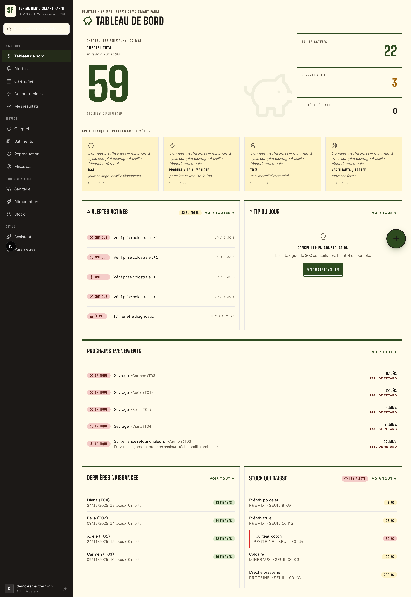 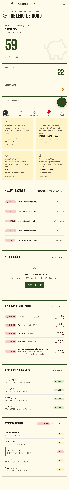 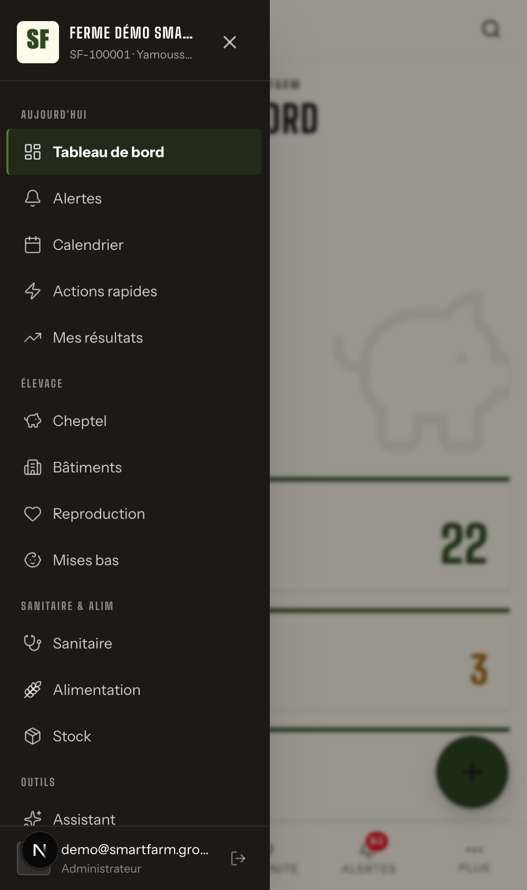

#### Forces
- Cheptel total 59 en énorme (~80px) lisible 3s plein soleil
- Trio cheptel (59/22/3) bien hiérarchisé
- Codes couleur cohérents (vert OK, ambre warn, rouge alert)
- Drawer mobile **4 groupes vocab terrain** clair (AUJOURD'HUI/ÉLEVAGE/SANITAIRE & ALIM/OUTILS)
- Section "TIP DU JOUR" pédagogique avec CTA

#### Frictions P0
| # | Bug | Impact | Reco |
|---|---|---|---|
| 1 | 4 cartes "Données insuffisantes" identiques (ISSF/Prod num/TMM/Nés vivants) | 20% écran desktop gaspillé | Replier en 1 bandeau compact "4 KPI en attente — saisir 4 portées de plus" + lien |
| 2 | "STOCK QUI BAISSE / 1 EN ALERTE" mais 5 items listés sans distinction | Éleveur ne sait pas LEQUEL alerte → scan obligatoire | Badge rouge inline sur item critique uniquement, autres en gris |
| 3 | "PROCHAINS ÉVÉNEMENTS" = 100% "X J DE RETARD" rouge | "Prochains" = futur, contenu = passé. Mensonge sémantique | Renommer "ÉVÉNEMENTS EN RETARD" + section séparée "À VENIR 7J" |
| 4 | "ALERTES ACTIVES" : 5 lignes "Vérif prise colostrale" sans différenciation portée | Impossible prioriser action immédiate | Grouper par type + compteur ("5× colostrum à vérifier") + tri par âge alerte |
| 5 | Aucune comparaison vs référentiel IFIP inline | Éleveur ne sait pas si "bon" ou "mauvais" | Badge sparkline + cible IFIP (`TMM 8% / cible ≤8%` vert) |

#### Glanceability 3s : test
**"Que dois-je faire MAINTENANT ?" — NON.** L'œil voit d'abord 4 cartes jaunes "Données insuffisantes" (zone gaspillée) puis doit descendre pour les vraies alertes. Hiérarchie inverse l'urgence : décoratif en haut, actionnable en bas. Éleveur Android plein soleil abandonne avant scroll.

#### Reco refonte priorisée (top 3)
1. **Tuer les 4 cartes "Données insuffisantes"** → bandeau 1 ligne replié. Gain : +25% espace utile above-fold.
2. **Fusionner "ALERTES ACTIVES" + "PROCHAINS ÉVÉNEMENTS"** en un seul "À FAIRE AUJOURD'HUI" trié par urgence.
3. **Inline IFIP benchmarks** sur chaque KPI technique.

---

### 3. Cheptel

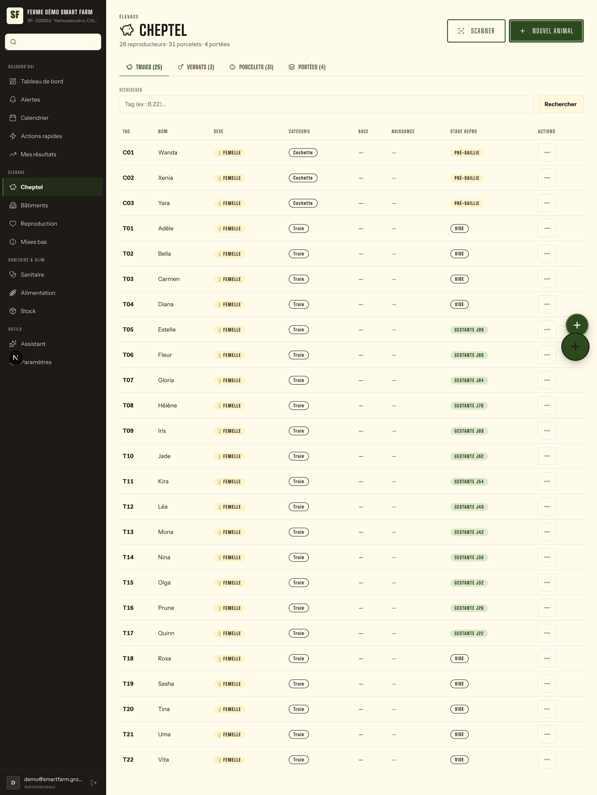  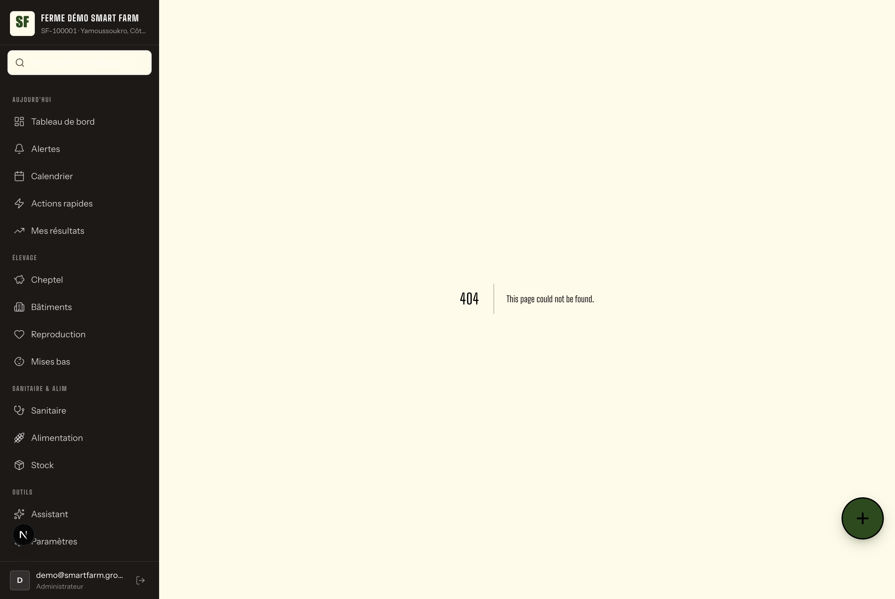 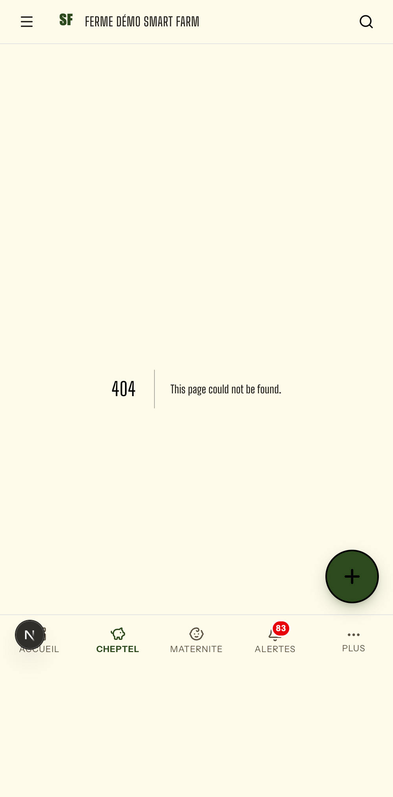

#### Forces
- **Tags métier visibles** (T01-T22, C01-C03, V01-V03, P060-XX, P090-XX) : naming pro
- **Stade repro EXPOSÉ** : `GESTANTE J08/J64/J82`, `VIDE`, `PRÉ-SAILLIE`, `ALLAITANTE`. Excellent vs statut DB générique
- 4 onglets segmentent bien (Truies/Verrats/Porcelets/Portées)
- SCANNER + NOUVEL ANIMAL en header desktop
- Mobile : tab bar bas avec CHEPTEL dédié + badge Alertes 83

#### Frictions P0
| # | Bug | Reco |
|---|---|---|
| 1 | **Tab TRUIES (25) mélange 22 truies + 3 cochettes** (C01-C03) | Séparer onglet "COCHETTES (3)" OU filtre rapide |
| 2 | **Cards mobile = 8 lignes verticales** par animal (~280px) | Card compacte : Tag+Nom+Stade en 1 ligne, reste en accordéon, cible 80-100px |
| 3 | **Tab PORCELETS (31)** : checkbox sans batch action visible | Batch (Peser/Vacciner/Sevrer sélection), regrouper par bande/portée |
| 4 | **Race vide (—)** pour 25 reproducteurs + **Naissance vide (—)** | Seed démo cohérent LW/Landrace/Piétrain/Duroc/Korhogo |
| 5 | **Compteur header "31 porcelets" vs onglet "(31)"** + 31 cards mais "33 PORCELETS" annoncé page hors tab | Aligner compteurs ou expliciter "31 actifs / 33 totaux" |
| 6 | **Mobile fiche truie** : 5 zones empty state juxtaposées (Pesée / Portées / BCS / Performances / Reproduction "à venir") | 1 seul empty state "Commence par : [Pesée] [BCS] [Saillie]" |

#### Frictions P1
- Menu kebab `…` = 2 taps pour Saillir/Diag/MB (vs 1 tap inline contextuel selon stade)
- Recherche bouton "Rechercher" séparé au lieu de live-filter
- 0 photo/avatar animal (reconnaissance visuelle terrain impossible)
- 2 FAB verts empilés en bas-droite desktop (lequel est lequel ?)
- Cmd+K search global présent mais non-discovrabilité
- Texte `<BarcodeScanner>` exposé littéral (déjà fixé Hermes S5)

---

### 4. Stock ⭐ (FOCUS PRIORITAIRE)

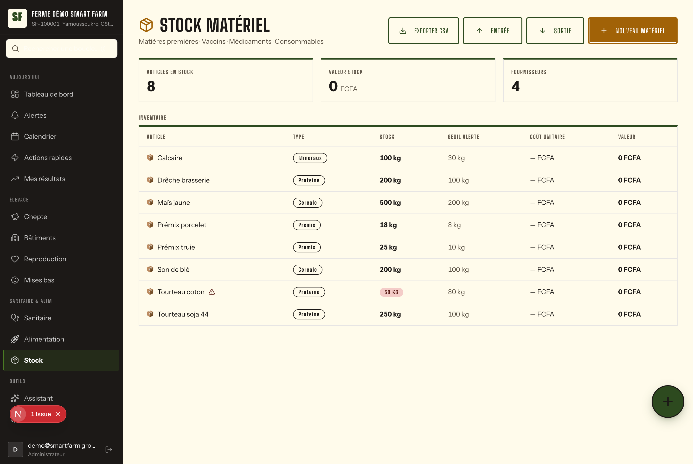 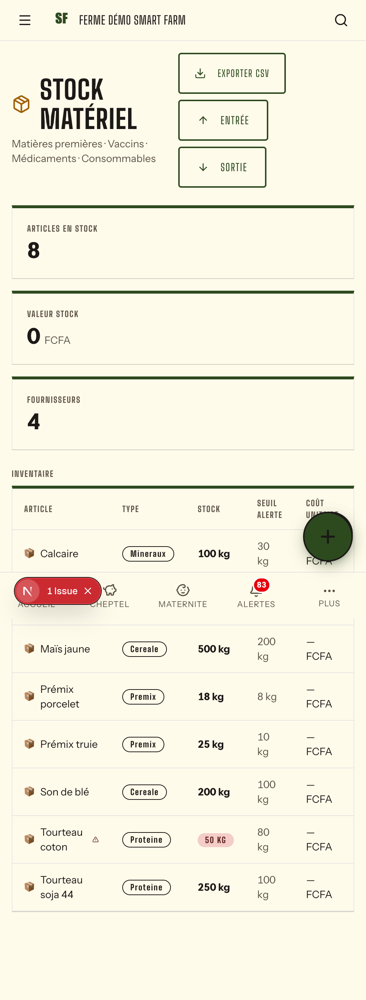

#### État actuel (snapshot)

| Élément | État |
|---|---|
| Articles seedés ferme démo | **8** (Calcaire, Drêche brasserie, Maïs jaune, Prémix porcelet, Prémix truie, Son blé, Tourteau coton, Tourteau soja 44) |
| Référentiel matières standard CI | **22 entrées** (NRC 2012 + INRA 2018 + IFIP, prix XOF/kg) |
| Référentiel concentrés industriels | IVOGRAIN, De Heus, Koudijs, Vitalac, Maridave |
| **Produits véto** | **0** — saisie 100% libre via type `vaccin`/`medicament`/`desinfectant` |
| Unités prédéfinies | **0** — input texte libre |
| Mutation stock | Manuelle (race conditions possibles, pas de trigger SQL) |
| Mouvements stock historique UI | **0** (table existe, jamais affichée) |

#### Forces
- Référentiel matières CI **excellent** (22 ingrédients, NRC/INRA, prix XOF/kg, notes "risque mycotoxines", "importé via Abidjan")
- Fonction `RPC seed_matieres_premieres_standards(p_ferme)` idempotente + préserve saisies user
- KPI utiles : Articles / Valeur / Fournisseurs
- Bouton "Réinitialiser au catalogue standard" sur `/alimentation/matieres`

#### Frictions P0
| # | Bug | Mesure | Reco |
|---|---|---|---|
| 1 | **FAB mobile cassé** : `_fab.tsx:41-42` passe `matieres=[]` `fournisseurs=[]` → liste vide | 100% entrées via FAB échouent | Convertir page en wrapper qui passe props au FAB |
| 2 | **Aucun référentiel véto** alors que marché CI structuré | 1 produit véto = 5-8 taps clavier mobile | Créer `seed_veterinaires_standards(p_ferme)` avec 20+ refs CI |
| 3 | **Unités texte libre** : `kg`, `Kg`, `KG`, `sac`, `sac 50`, `sacs` | Inventaire faussé | Enum SQL : `kg`/`g`/`L`/`mL`/`dose`/`sac_25`/`sac_50`/`unite`/`flacon`/`seringue` |
| 4 | **"1 EN ALERTE" dashboard vs 4 alertes réelles** /stock | Confiance perdue | Centraliser `isAlerte()` dans `lib/stock-helpers.ts` |
| 5 | **Casse incohérente** : ligne Tourteau coton `50 KG` majuscule (force `uppercase` CSS badge danger) vs autres `100 kg` minuscule | UI désordre | Retirer `text-transform: uppercase` badge danger OU normaliser unité à l'insert |
| 6 | **Sortie stock sans bande visible** : `bandes` prop `[]` par défaut, jamais chargée | 0 traçabilité "qui a mangé quoi" | Charger `sb.from('bandes')` dans `page.tsx`, passer au Dialog |

#### Frictions P1
- Pas de page "Mouvements stock" (historique entrées/sorties non affiché)
- Pas d'alerte seuil bas dans `alertes-engine.ts` (seul compteur dashboard reflète)
- Sortie 100% manuelle (pas de hook auto depuis `consommations_aliment`)
- Pas d'inventaire physique / écart toléré
- Pas de FK `matieres.fournisseur_id` (texte libre)
- Coût unitaire à l'entrée non utilisé pour recalculer CUMP

#### Test "entrée 5 sacs maïs + sortie 30 kg bande B22"

**Desktop** :
- Article (select) : 1 tap + scroll
- Date (autofill today) : 0 tap
- Quantité : 1 tap + clavier (**5 sacs ou 250 kg ?** ambigüité)
- Coût unitaire : 1 tap (optionnel non marqué)
- Fournisseur, Référence BL, Soumettre : 3 taps
- **Total : 6-8 taps, ~30 sec**

**Mobile via FAB** : **IMPOSSIBLE** (bug P0 #1)

**Sortie 30 kg bande B22** : impossible aujourd'hui (champ bande masqué, bug P0 #6)

---

### 5. Santé & Protocoles

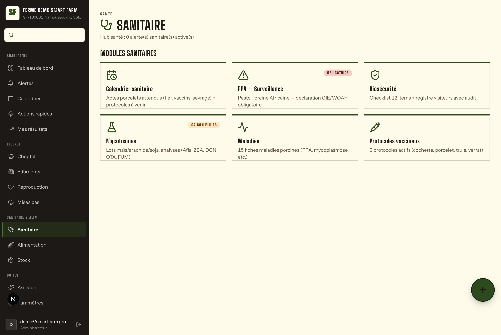 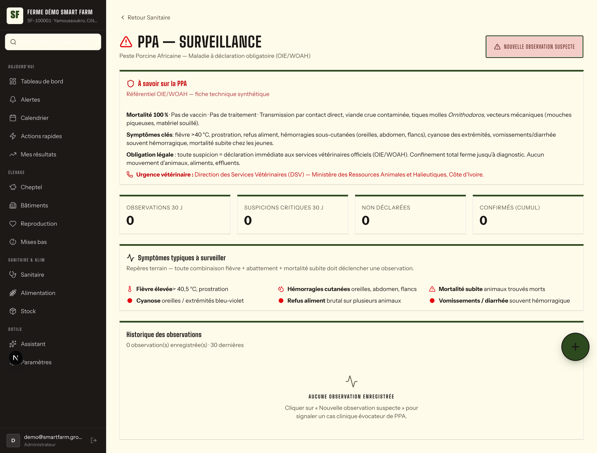 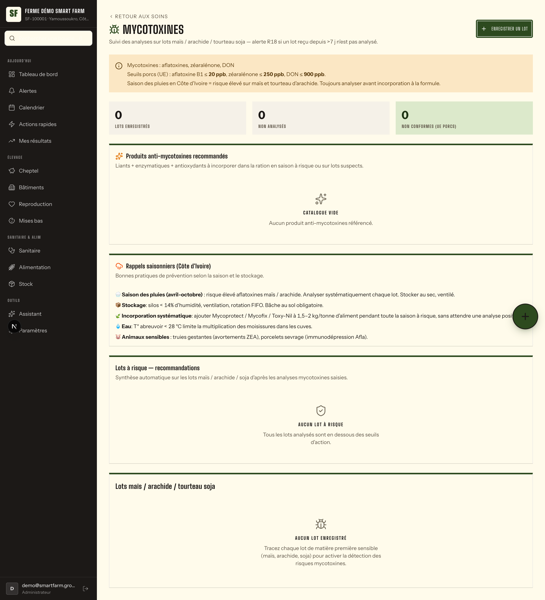 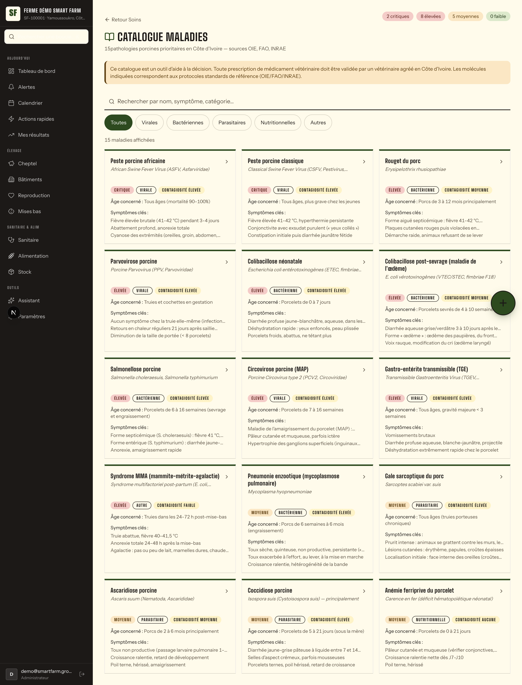 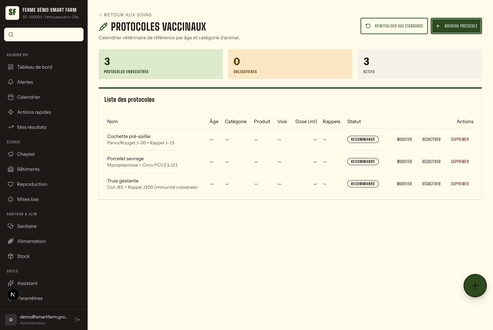 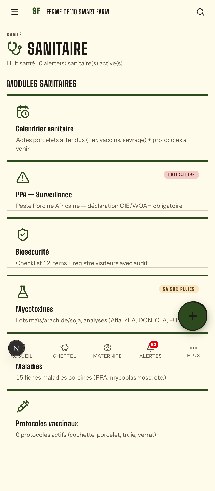

#### Forces
- Hub 6 modules clair, vocab pro juste (PPA/OIE, mycotoxines AFB1/ZEA/DON/OTA/FUM)
- Badges contextuels : `OBLIGATOIRE` (PPA), `SAISON PLUIES` (Mycotoxines) — bon réflexe terrain CI
- Catalogue Maladies 15 fiches porcines réelles, taggées + criticité
- Page PPA : symptômes clés colorés + lien direct DSV CI + obligation légale
- Mycotoxines : seuils UE chiffrés (AFB1 20ppb, DON 900ppb) + recos saisonnières CI
- Protocoles vaccinaux : 3 standards pré-câblés (cochette Parvo/Rouget J-30, porcelet Mycoplasmose+Circo J21, truie Coli J85)

#### Frictions P0
| # | Module | Bug | Reco |
|---|---|---|---|
| 1 | Hub | Hiérarchie urgence absente | Sticky top : Calendrier (compteur retard rouge) + PPA |
| 2 | Calendrier | **100% vide** — "Aucun protocole configuré" alors que 3 protocoles existent | Bug câblage : lire `protocoles_vaccinaux` actifs + projeter sur cheptel |
| 3 | Protocoles | Colonnes Produit/Dose/Voie/Rappels toutes vides (—) | Bloquer enregistrement si vide |
| 4 | Biosécurité | "Checklist non disponible" — promise 12 items absente | Implémenter checklist (sas, pédiluve, quarantaine, rongeurs…) sinon retirer du hub |
| 5 | Maladies | Catalogue read-only, 0 lien "Déclarer un cas/traitement" | Bouton "DÉCLARER UN CAS" → form pré-rempli |
| 6 | Global | **AUCUN module "Acte sanitaire" enregistrable** — pas de carnet | Créer entité `actes_sanitaires` (animal/bande + produit + dose + voie + opérateur + date + délai attente auto) |

#### Manques métier critiques (RÉGLEMENTAIRE)

1. **Carnet sanitaire MIRAH exportable** — obligation MIRAH/DSV CI, 0 export PDF/CSV
2. **Traçabilité antibiotique** — registre obligatoire (animal, ATB, dose, durée, opérateur, ordonnance véto) totalement absent
3. **Délai d'attente viande automatique** — critique export filière (ex: Amoxicilline 28j, Tylosine 14j)
4. **Déclaration PPA pré-remplie DSV** — workflow promis "OIE/WOAH" mais non implémenté
5. **Mortalités motifs codifiés** — 0 module mortalité visible (devrait être : asphyxie/écrasement/hypothermie/diarrhée/malformation/PPA suspect/indéterminé)
6. **Seuils mycotoxines différenciés par catégorie** — affiche seuils UE uniformes, manque truies gestantes AFB1 <5ppb (avortements) / porcelets DON <500ppb
7. **Ordonnance vétérinaire scannée** — pas d'upload PDF/photo ordonnance liée au traitement

#### Test traitement bande
Scénario "Enregistrer diarrhée bande B22 → Sorbitonic + Bimestimul" : **IMPOSSIBLE**. Aucun bouton "Enregistrer traitement/acte" dans tout le hub. Module uniquement consultatif. Bloquant P0.

---

### 6. Indicateurs IFIP (couvert manuellement — SA6 échoué)

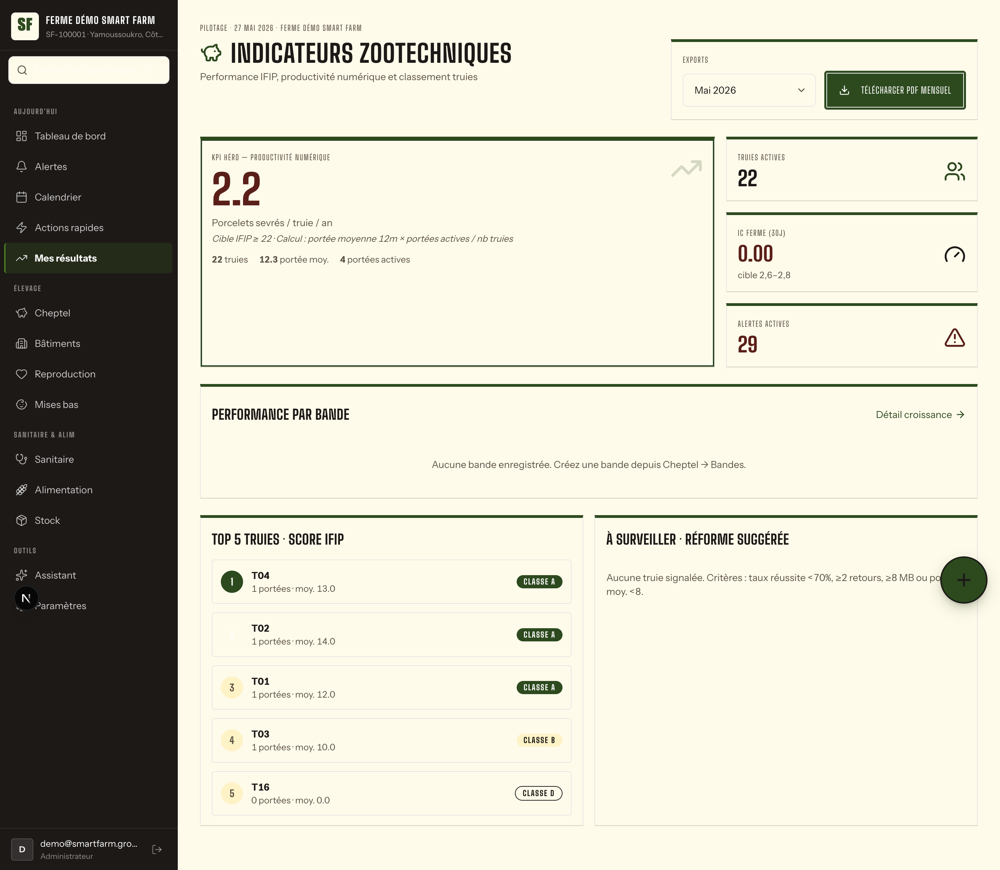

#### KPI présents / absents

| KPI IFIP | Présent | Calcul auto | Comparaison cible inline |
|---|---|---|---|
| **ISSF** (Intervalle Sevrage-Saillie Fécondante 5-7j) | ✅ KPI hero | ⚠️ "Données insuffisantes" | ❌ |
| **Productivité numérique** (≥22 porcelets sevrés/truie/an) | ✅ KPI hero | ⚠️ Affiche 2.2 (denominateur faux : inclut cochettes sans portée) | ❌ |
| **TMM** (Taux Mortalité Maternité ≤8%) | ✅ | ⚠️ Données insuffisantes | ❌ |
| **GMQ par stade** (porcelet 450g/croissance 750g/finition 850g) | ❌ Absent | n/a | n/a |
| **IC engraissement** (cible 2.6-3.2 climat tropical) | ❌ Absent | n/a | n/a |
| **Taux mise-bas** | ❌ Absent | n/a | n/a |
| **Taux retour chaleurs** | ❌ Absent | n/a | n/a |
| **Rang de portée + parité** | ❌ Absent | n/a | n/a |
| **Mortalité par stade** (naissance-sevrage, sevrage-25kg, 25-110kg) | ❌ Absent | n/a | n/a |

#### Frictions P0
| # | KPI | Bug | Reco |
|---|---|---|---|
| 1 | Productivité | 2.2 affiché (truies improductives incluses, dénominateur faux) | Exclure cochettes & truies <2 portées du calcul |
| 2 | Classe IFIP | B.19/B.21 "0 portées · CLASSE D" | Cochette/primipare en attente ≠ Classe D. Filtre `parite >= 2` |
| 3 | Visualisation | Tout en chiffres, 0 sparkline/courbe/jauge | Ajouter mini-charts recharts par KPI |
| 4 | Tropical CI | Aucun ajustement saisonnier visible | Affichage "GMQ corrigé climat +30°C : -150g attendu" |
| 5 | Personnalisation | Objectifs IFIP affichés mais non éditables par ferme | Section /parametres "Mes objectifs personnalisés" |

#### Manques IFIP critiques
1. **Gestion en bande** — cœur productivité moderne, ABSENT (carnet papier numérisé)
2. **Rang de portée + parité** — KPI IFIP se calculent **par parité**
3. **GMQ + IC par stade** — sans GMQ, pas de pilotage technique
4. **Adoption/croisement portées** — pratique quotidienne maternité absente
5. **Courbe alimentation truie liée à l'individu** (flushing/gestation/lactation)

---

### 7. Mode hors-ligne & Performance

#### PWA
- **Installable** : ✅ (manifest valide, icons 192/512 maskable, theme #2D4A1F, start_url /dashboard, scope /, shortcuts Dashboard/Cheptel/Alertes)
- **Service worker** : strategy hybride (cache-first assets statiques + `_next/static`, network-first pages HTML avec fallback /dashboard, **bypass Supabase + /api** = always network)
- SW enregistré **uniquement en prod**

#### Mode offline (critique)
- ❌ **Indicateur visuel online/offline** : 0 réf `navigator.onLine`, pas de banner, pas de toast
- ❌ **Queue locale mutations** : 0 IndexedDB, 0 `localStorage` queue, aucune lib `dexie/idb-keyval/workbox-background-sync`
- ❌ **Sync reconnexion** : pas de Background Sync API, pas de listener `online`, pas de retry queue
- Client Supabase = `createBrowserClient` standard, **aucune couche offline-first** malgré claim metadata `"offline-first, mobile"`
- Saisies offline → SW renvoie `{error:"Pas de connexion réseau", offline:true}` HTTP 503 = **mutation perdue silencieusement**

#### Performance estimée
- **Bundle JS prod** : ~2.0 MB total (chunks `.next/static/chunks` = 3.9 MB incl. maps, top chunk 370 KB, 4 chunks >290 KB)
- **CSS** : 1 chunk 133 KB (Tailwind v4 non-purgé probable)
- **TTI estimé 4G CI** (1.5 Mbps réel) : ~6-9s première visite, ~2-3s avec SW cache
- **Streaming RSC** : ✅ (`loading.tsx` sur 8 routes principales)
- **ISR** : 1 seule route `force-static` (performances), reste `force-dynamic` = **aucun cache CDN**
- **Edge runtime** : ❌ (Hostinger Passenger Node monolithe)
- **Lighthouse estimés** : Perf 55-65 · A11y 75-85 · BP 80 · PWA 70

#### Frictions P0 (offline)
| # | Bug | Impact terrain CI 3G | Reco |
|---|---|---|---|
| 1 | Aucune queue mutations offline | Éleveur perd saisies pesée/saillie en zone blanche | Workbox Background Sync + IndexedDB queue (lib `idb` 4 KB) |
| 2 | Pas d'indicateur online/offline | Éleveur croit avoir sauvé alors que 503 silencieux | Hook `useOnlineStatus` + banner sticky top |
| 3 | SW renvoie 503 JSON sur Supabase = toast erreur générique | UX cassée hors-ligne | Intercepter côté client : si offline → push en queue, optimistic UI |
| 4 | `force-dynamic` quasi partout | Chaque nav = round-trip Supabase = 3-5s en 3G | ISR 60s sur dashboard/KPI/cheptel + revalidateTag sur mutation |
| 5 | Bundle 370 KB top chunk + 4× >290 KB | TTI 8+s en 4G dégradée | Code-split assistant chatbot, lazy-load recharts, dynamic import shadcn |
| 6 | CSS 133 KB | Tailwind v4 mal purgé probable | Vérifier `@source` paths globals.css |
| 7 | Pas de page `/offline` dédiée | Fallback `/dashboard` requiert auth → boucle | Créer `app/offline/page.tsx` statique |

#### Verdict
**Smart Farm N'EST PAS utilisable en 3G dégradée / hors-ligne complet.** PWA installable + shell cache OK, mais **zéro offline-first malgré la promesse marketing**. Saisie en mode dégradé = perdue sans avertissement utilisateur. Bundle ~2MB + `force-dynamic` quasi partout = expérience 3G CI inacceptable.

**Caveman** : `PWA façade. Offline mort. À refondre avant claim "offline-first" en pitch.`

---

### 8. Rubrique Conseil ⭐ (FOCUS À ENRICHIR)

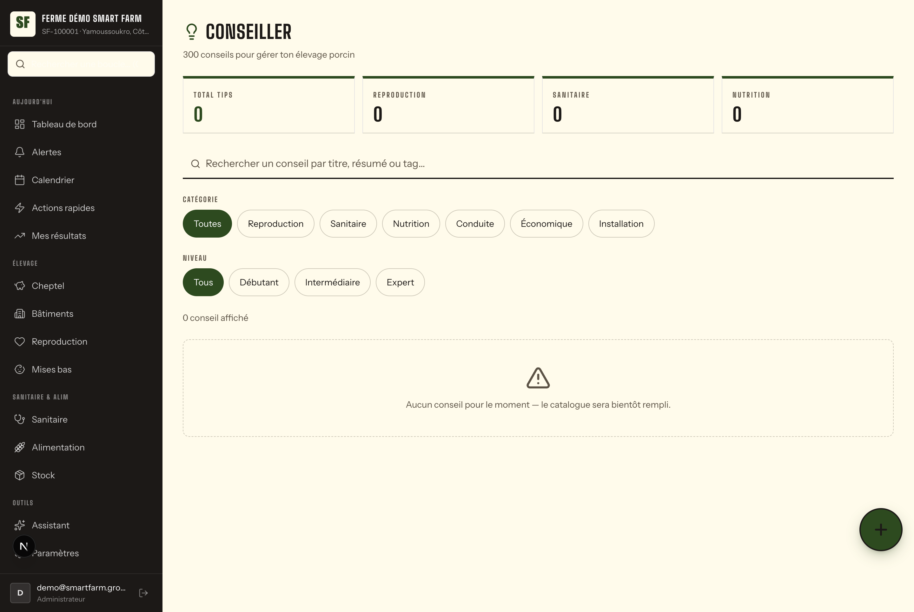 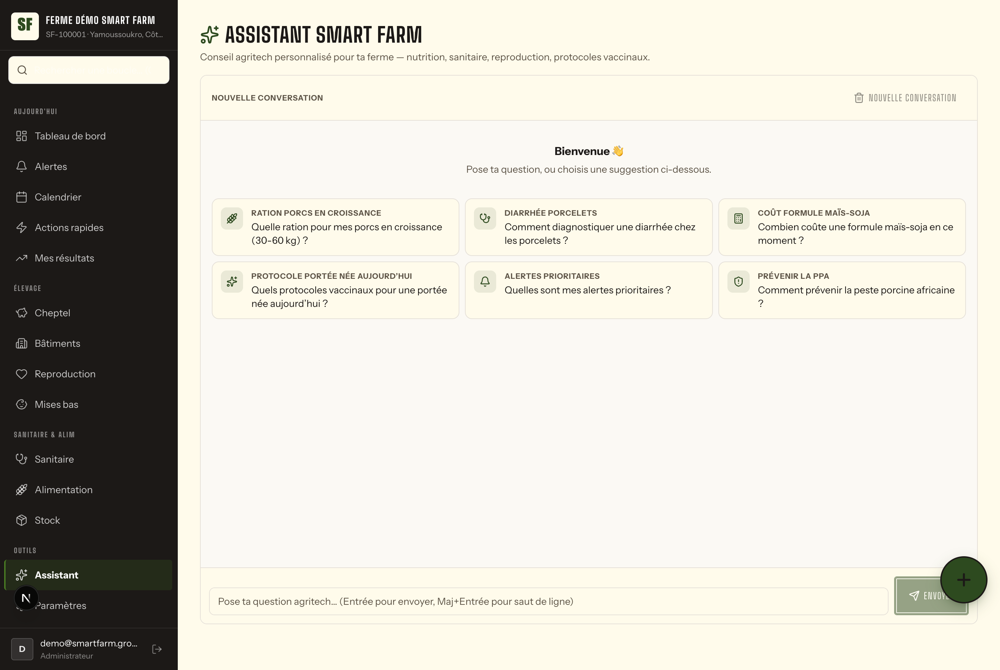 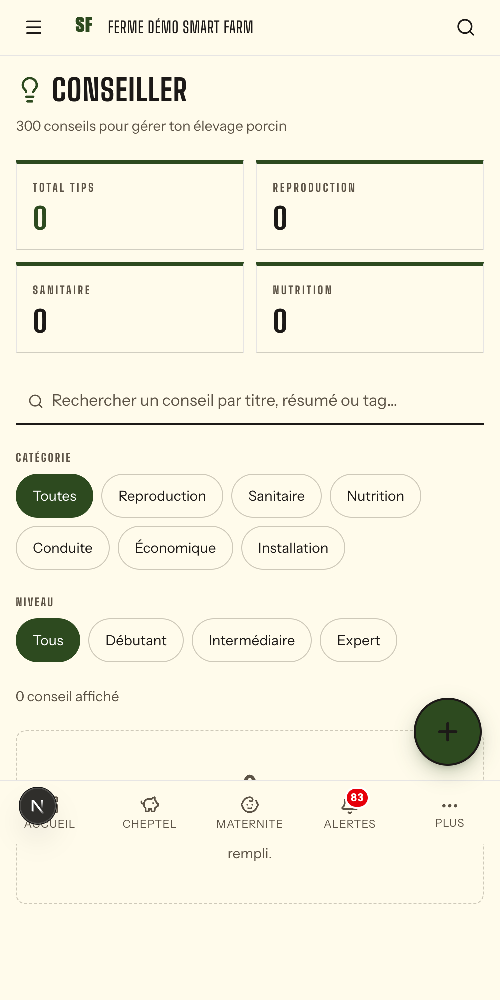

#### État actuel

**Deux routes distinctes mal articulées** :
- `/conseiller` (323L) : catalogue statique `tips_conseiller` (slug, titre, categorie, niveau, resume, contenu, tags, source). KPI cards Total/Repro/Sanit/Nutri. Filtres pills catégorie + niveau. Pagination 50/page.
- `/assistant` (46L) : chatbot streaming `/api/chatbot`, 6 suggestions hardcodées, persistance localStorage 50 msg, HMAC session token.

**Header annonce "300 conseils"** mais screenshots montrent **TOTAL 0 / REPRO 0 / SANIT 0 / NUTRI 0** + empty state *"Aucun conseil pour le moment — le catalogue sera bientôt rempli"*. **Table `tips_conseiller` vide en prod démo = MENSONGE UX P0.**

**Conseils contextuels** : ZÉRO. Aucun lien entre cycle reproduction/animal/alerte et conseil affiché.

**Fiches techniques** : seulement via search-pills, aucun cross-link depuis fiche truie/portée/bande.

**Calendrier prévisionnel** : INEXISTANT côté conseil (route `/calendrier` séparée, pas branchée).

**Tips économiques** : champ `categorie='economique'` prévu mais 0 contenu, pas de prix matières CI.

**Push notif** : inexistant.

#### Frictions actuelles P0
1. **0 contenu en prod** alors que header promet 300 conseils → casse confiance dès 1er clic
2. **Conseil zéro-contextuel** : éleveur cherche réponse à son problème, lit un catalogue générique → abandon
3. **Conseiller + Assistant siloés** : 2 outils mêmes besoins, 0 passerelle (assistant ne cite pas les fiches, conseiller ne propose pas "demander à l'assistant")
4. **Pas de déclencheur métier** : aucune alerte ne pointe vers fiche conseil
5. **Mobile** : 4 KPI cards à 0 + filtres niveau bouffent toute la fold avant 1 conseil

#### Propositions enrichissement (PRIORITÉ — c'est LE différenciateur potentiel)

**A. Conseils contextuels selon phase cycle** — brancher `tips_conseiller.trigger_phase[]` + service `getContextualTips(animal, cycle_day)`

| Phase | Conseil push auto |
|---|---|
| Saillie J0 | Vérif réflexe immobilité, double saillie 12-24h, noter heure |
| Gestation J18-J24 | Surveiller retours chaleurs (échec saillie probable) |
| Gestation J28 | **Échographie : créneau optimal J28-J35** + CTA scanner |
| Gestation J60 | Vermifuge + vaccin parvovirose-rouget |
| Pré-MB J100-J114 | Lavage truie J108, transfert maternité J110, rappel vaccin colibacille, préparer case (T° 28°C porcelets / 18-20°C truie) |
| Maternité J0-J3 | Colostrum <6h obligatoire, coupe cordon iode, fer J3 |
| Maternité J0-J28 | Ration croissante 3→7 kg, eau 30 L/j, T° lampe 32→25°C |
| Sevrage J21-J28 | Aliment 1er âge progressif J17, retrait porcelets matin, truie diète 24h |
| Post-sevrage J4-J7 truie | Retour chaleurs attendu, flushing aliment, préparer verrat/IA |

**B. Catalogue 40 fiches MVP** — Reproduction (8) · Sanitaire (10) · Nutrition (8) · Conduite (6) · Économique (5) · Biosécurité/Installation (3) · Réglementaire CI MIRAH/LANADA (NEW)

**C. Calendrier prévisionnel auto** — vue `/calendrier` enrichie + widget dashboard, auto-générée depuis `saillies` + `mises_bas`, items (MB attendues 7j, sevrages 7j, retours chaleurs 7j, vaccins dus, échographies dues, vide sanitaire planifié), chaque item → CTA "Voir fiche conseil", export iCal

**D. Tips économiques CI** — table `prix_matieres_ci` MAJ mensuelle (OCPV CI, marchés Adjamé/Bouaké/Korhogo), calculateur ROI portée

**E. Push notifications utiles (10)** — saillie J+18, gestation J+28 échographie, J+100 préparer maternité, MB J+1 colostrum, MB J+3 fer, MB J+21 sevrage 7j, sevrage J+5 retour chaleurs, T° bâtiment >32°C 3h, saison pluies juin/sept mycotoxines, alerte régionale PPA. Préférences user-controlled, canal in-app + email + **WhatsApp** (intégration future critique CI)

#### Architecture proposée
- **Fusion** `/conseiller` + `/assistant` → hub `/conseil` : 3 cartes (Mes conseils du jour · Demander à l'IA · Catalogue)
- Schema BDD ajouts : `trigger_phase[]`, `trigger_days_offset`, `urgence`, `video_url`, `photo_url`, `audience[]`, `region_ci[]`
- Cross-link partout : alerte → conseil, fiche animal → conseil cycle, assistant → cite fiches

#### Verdict
**OUI** — c'est LE différenciateur potentiel vs Isagri PigUP (générique Europe) / agriNet (annonces) / SIGA (statistiques admin). Aucun concurrent n'offre **conseil contextuel temps réel adapté tropical CI**.

**Conditions pour devenir indispensable** :
1. Remplir réellement 40 fiches MVP **avant marketing** (sinon mensonge UX)
2. Brancher contextuel (sans ça reste Wikipédia)
3. WhatsApp push (canal éleveur CI réel, pas in-app seul)
4. Co-écriture ANADER + vétérinaires CI = crédibilité + canal distribution gratuit

**Sans ces 4 → Smart Farm reste un Excel++. Avec → outil quotidien irremplaçable.**

---

### 9. Design System

#### Forces
- **Palette canonique cohérente** sur 9/9 écrans : sahel-700, or-600, latérite-700, mil-50 uniforme. **Aucune dérive chromatique.**
- **Big Shoulders Display** systématique sur H1 + KPI chiffres (59, 22, 620 kg, 8) + eyebrows uppercase. Identité forte, reconnaissable instantanément.
- **Hiérarchie typo claire** : eyebrow 12px uppercase / H1 Big Shoulders 32-40px / body Instrument Sans 14-16px
- **Cards hubs** (Sanitaire, Alimentation) parfaitement uniformes
- **Sidebar** identique sur 6 desktop : 4 groupes vocab terrain (Aujourd'hui / Élevage / Sanitaire & Alim / Outils)

#### Patterns systémiques cassés
1. **Double FAB superposé** (cheptel desktop, alim, sanitaire, stock) : 2 ronds verts `+` empilés visibles → bug empilement Actions rapides + FAB contextuel. Présent **4 écrans**
2. **Bottom nav mobile mange le FAB** (mobile-04, mobile-08) : FAB `+` chevauche nav bottom. Z-index conflit **2/3 mobile**
3. **Mobile cheptel = stack vertical illisible** : pattern table desktop dupliqué bêtement sur mobile
4. **Coût 0 FCFA partout** (stock 8 lignes, alim KPI) : empty state non géré
5. **KPI placeholder "—"** mélangé avec `0` et valeurs réelles (alim hub : `620 kg / 0 FCFA / — / 1 j`)

#### Frictions P0
| # | Sujet | Bug | Reco |
|---|---|---|---|
| 1 | FAB double | 2 boutons `+` empilés sur 4 écrans | Fusionner FAB global + contextuel OU décaler 64px |
| 2 | Mobile FAB vs bottom nav | Chevauchement z-index | FAB `bottom-20` au-dessus nav, OU intégrer `+` central dans nav |
| 3 | Mobile cheptel | Table desktop stackée → 25 animaux = 175 lignes scroll | Card mobile : tag + nom + badge stade sur 2 lignes |
| 4 | Empty `0 FCFA` | Confond "pas saisi" et "vraiment zéro" | Tokens `—` quand `null`, `0` quand `=0` |

#### Frictions P1
- Eyebrows 12px uppercase gris clair sur mil-50 → contraste **~3.8:1**, sous WCAG AA (4.5:1 requis). Passer à terre-900/70%
- Badges stade repro : Big Shoulders sur badge = lourd, casse hiérarchie. Réserver Big Shoulders aux titres + chiffres KPI uniquement
- Boutons header incohérents : `SCANNER` outlined vs `+ NOUVEAU ANIMAL` filled vs `NOUVEAU MATÉRIEL` filled orange (3 styles primaires concurrents)
- Animations : aucune visible (pas de skeleton, pas de transition)
- Dark mode : absent (OK pour terrain plein soleil mais à signaler)

#### Tokens à corriger
- `--color-eyebrow: oklch(from terre-900 l c h / 0.72)` — fix contraste AA
- `--fab-z: 40`, `--bottom-nav-z: 50` — résoudre superposition mobile
- `--empty-value: "—"` constant (jamais `0` quand `null`)
- `--badge-font: Instrument Sans 600` (retirer Big Shoulders des badges)
- `--btn-primary-bg`: une seule couleur (sahel-700). Or réservé KPI/accent, pas bouton

#### Verdict cohérence /10
**7/10** — Identité forte cohérente (palette, typo, hubs). Cassée par 2 bugs UX visibles (double FAB, mobile cheptel) + 1 dette sémantique (vide vs zéro). Corrigible en 1 sprint focalisé composants partagés.

---

### 10. Sécurité & Conformité

#### Headers HTTP (`app/next.config.ts`)
- **HSTS** : ✅ `max-age=63072000; includeSubDomains; preload` (2 ans, preload-ready)
- **CSP** : ❌ **LAXISTE** — `script-src 'self' 'unsafe-inline' 'unsafe-eval'` + `style-src 'unsafe-inline'`. Commentaire admet "à durcir Phase 2 avec next-nonce". XSS quasi-pas mitigé.
- **X-Frame-Options** : ✅ `DENY` (+ `frame-ancestors 'none'` en CSP, double ceinture)
- **X-Content-Type-Options** : ✅ `nosniff`
- **Referrer-Policy** : ✅ `strict-origin-when-cross-origin`
- **Permissions-Policy** : ✅ `camera=(), microphone=(), geolocation=()` minimaliste

#### Auth & Sessions
- **Session timeout** : ❌ non configuré explicitement (Supabase JWT 1h + refresh auto par défaut). Pas d'idle-timeout
- **Politique pass** : `password.length < 8` uniquement (`_actions.ts:137`). ❌ **Pas de complexité** (zéro check majuscule/chiffre/symbole)
- **RLS multi-tenant** : ✅ `ferme_id IN (SELECT ferme_id FROM user_farms WHERE user_id = auth.uid())`. Test daily `tests/rls-cross-farm.sh` probe 7 tables, exit 2 si leak. **Solide.**
- **Service role côté client** : ✅ usage strictement Server Actions (`createServiceClient()` dans `lib/supabase/server.ts`, throw si key absente, jamais inliné bundle)

#### Conformité réglementaire
- **ARTCI** : mentionné footer connexion uniquement ("plateforme déclarée à l'ARTCI") — texte plat **non cliquable**, pas de n° déclaration. Signal faible
- **ISO 22005** : "● Conforme ISO 22005" sur landing — ❌ **non vérifié, aucune preuve, aucun audit cité**. **Mensonge marketing potentiel** (ISO 22005 = traçabilité, exige audit organisme tiers)
- **RGPD + loi CI 2013-450** : ❌ **AUCUNE mention** dans la codebase. Aucune page `/mentions-legales`, `/cgu`, `/politique-confidentialite`. "Données hébergées en UE" sans précision hébergeur
- **Export user data** (RGPD art. 20) : partiel — CSV par table whitelistée via `ExportButton` (RLS appliqué) mais pas d'export global "mes données"
- **Suppression compte** (RGPD art. 17) : ❌ page `/parametres` ne propose ni bouton "supprimer compte" ni "exporter mes données"

#### Frictions P0
| # | Sujet | Risque | Reco |
|---|---|---|---|
| 1 | CSP `unsafe-inline` + `unsafe-eval` | XSS non mitigée, exfil cookies session | Migrer `next-nonce` (Next 16 supporte) |
| 2 | "Conforme ISO 22005" sans audit | Publicité mensongère, réputation, recours client | Retirer claim OU lancer audit Bureau Veritas/SGS |
| 3 | Zéro mention RGPD/CGU/politique conf. | Loi CI 2013-450 + RGPD UE non couvertes, sanctions ANPDP | Créer `/mentions-legales` + `/politique-confidentialite` + lien footer global |
| 4 | Pas de suppression compte ni export global | Art. 17 + 20 RGPD non respectés | Ajouter `parametres/compte` : bouton "Exporter mes données (ZIP)" + "Supprimer mon compte" |
| 5 | Politique pass = longueur 8 seule | Bruteforce / dictionnaire faciles | Ajouter regex complexité OU activer Supabase password strength check |

#### Verdict sécurité : **5.5/10**
- **Forts** : RLS multi-tenant robuste + test daily, HSTS preload, service_role isolé serveur, X-Frame-Options DENY double ceinture
- **Faibles** : CSP laxiste (unsafe-inline/eval), claim ISO 22005 non sourcé, RGPD totalement absent UI/contenu, pas UX suppression/export compte
- **Bloquants prod EU** : F#3 + F#4 (RGPD) — un signalement CNIL/ANPDP suffit à exposer. F#2 (ISO 22005) = risque image immédiat

---

## Plan d'action consolidé

### Phase A — Quick wins (1 semaine, ~12h)

| # | Item | Module | Effort |
|---|---|---|---|
| A1 | **Fix FAB mobile Stock** : passer `matieres`/`fournisseurs` props depuis page wrapper | Stock | 1h |
| A2 | **Retirer claim "Conforme ISO 22005"** de la landing (ou attendre audit) | Landing | 15min |
| A3 | **Renommer "PROCHAINS ÉVÉNEMENTS"** en "ÉVÉNEMENTS EN RETARD" | Dashboard | 15min |
| A4 | **Centraliser `isAlerte()` stock** dans `lib/stock-helpers.ts` — fixe "1 EN ALERTE" mensonger | Stock + Dashboard | 30min |
| A5 | **Normaliser casse unités** stock (`50 KG` → `50 kg`) — virer `uppercase` CSS badge danger | Stock | 30min |
| A6 | **"TESTER MODE DÉMO"** bouton hero landing direct + retirer 3 liens header morts | Landing | 1h |
| A7 | **Validation inline formulaire inscription** (email + password ≥8) | Inscription | 1h |
| A8 | **Replier 4 cartes "Données insuffisantes"** dashboard en 1 bandeau | Dashboard | 1.5h |
| A9 | **Bouton "Supprimer mon compte" + "Exporter mes données"** /parametres/compte (RGPD art. 17 + 20) | Sécu | 3h |
| A10 | **Pages `/mentions-legales` + `/politique-confidentialite` + `/cgu`** stubs FR/CI conformes | Sécu | 3h |

### Phase B — Refactor friction de saisie (2-3 semaines, ~40h)

| # | Item | Effort |
|---|---|---|
| B1 | **Référentiel véto CI** : `seed_veterinaires_standards(p_ferme)` 20 refs (PPC/Pasteurellose/Ivermectine/Bimestimul/Sorbitonic/Tylosine/Pénicilline/etc.) | 5h |
| B2 | **Enum unités SQL** strictes (kg/g/L/mL/dose/sac_25/sac_50/flacon/seringue) + migration tables stock + UI selects | 4h |
| B3 | **Entité `actes_sanitaires`** : schéma + dialog "Enregistrer traitement" (animal/bande + produit liste + dose + voie + opérateur + date + délai attente auto) | 8h |
| B4 | **Carnet sanitaire MIRAH exportable** PDF + CSV depuis `actes_sanitaires` | 4h |
| B5 | **Traçabilité antibiotiques** : registre dédié + upload ordonnance véto | 6h |
| B6 | **Bulk action porcelets** liste avec sélection multi-cases + dialog batch (transition stade D2/Croissance/Finition) | 4h |
| B7 | **Lookup truies pré-rempli dialog DIAGNOSTIC** (pré-sélection saillie contextuelle) | 2h |
| B8 | **Composant `<EmptyOnboarding>`** unique appliqué 8 écrans (illustration + 2 lignes + CTA) | 3h |
| B9 | **Tab COCHETTES (3)** séparé du tab TRUIES | 2h |
| B10 | **Garde-fous saisie métier** : sevrage ≥ MB, nés vivants ≥ sevrés, total nés ≤ 20 | 2h |

### Phase C — Enrichissement métier (1 mois, ~80h)

| # | Item | Effort |
|---|---|---|
| C1 | **Module Conduite en bande** (planning 21j synchronisé, batch operations bande entière) | 24h |
| C2 | **Rang de portée + parité** sur fiche truie + calculs IFIP par parité | 8h |
| C3 | **ISSF + Taux MB + TMM par parité** affichés inline cible IFIP | 6h |
| C4 | **GMQ + IC par stade** (porcelet/croissance/finition) avec graphs recharts | 8h |
| C5 | **Conseil contextuel** : `tips_conseiller.trigger_phase[]` + service contextuel dashboard | 10h |
| C6 | **40 fiches MVP catalogue conseiller** (Repro 8 / Sanitaire 10 / Nutrition 8 / Conduite 6 / Éco 5 / Bio 3) — co-écriture ANADER | 16h |
| C7 | **Calendrier prévisionnel auto** depuis saillies + MB + cycles physiologiques + export iCal | 6h |
| C8 | **Tips économiques CI** : table `prix_matieres_ci` MAJ mensuelle + calculateur ROI portée | 4h |
| C9 | **Module Bande système** : conduite 7/10/21j synchronisée, vide sanitaire planifié | 12h |
| C10 | **Adoption / croisement portées** UI maternité | 4h |

### Phase D — Polish & standards 2026 (continu, ~30h)

| # | Item | Effort |
|---|---|---|
| D1 | **PWA offline-first réel** : Workbox Background Sync + IndexedDB queue + hook `useOnlineStatus` + banner | 12h |
| D2 | **Page `/offline` dédiée** statique + fallback intelligent | 2h |
| D3 | **CSP nonces** : migration `next-nonce`, retrait `unsafe-inline/eval` | 6h |
| D4 | **WhatsApp push notifications** intégration Twilio (10 notif utiles) | 8h |
| D5 | **Bundle splitting** : lazy-load assistant chatbot, recharts, shadcn dynamic imports | 4h |
| D6 | **ISR 60s** sur dashboard/KPI/cheptel + revalidateTag sur mutations | 3h |
| D7 | **Dark mode** Big Shoulders + Instrument Sans (low priority terrain plein soleil) | 6h |
| D8 | **Avatars/photos animaux** sur liste cheptel (mobile + desktop) + upload Supabase Storage | 6h |
| D9 | **Sparkline cards bâtiments** occupation 30j + barre progression visuelle | 3h |
| D10 | **2FA SMS optionnel** comptes admin (sécurité +) | 4h |

**Total effort consolidé** : ~**162h** (~4-5 semaines senior fullstack focus zéro distraction)

---

## Référentiels proposés à intégrer

### Matières premières CI (22 déjà seedées + 12 à ajouter)

**Déjà en base (22)** :
Maïs grain, Sorgho, Manioc séché, Patate douce séchée, Son de blé, Son de riz, Drêches brasserie, Tourteau de soja 48, Tourteau d'arachide, Tourteau de coton, Tourteau de palmiste, Farine de poisson 60, Carbonate de Ca, Phosphate bicalcique, Sel marin, Huile de palme, L-Lysine, DL-Méthionine, Prémix croissance, Prémix truie, IVOGRAIN (Porcelet/Croissance/Finition/Truie)

**À AJOUTER (12 critiques CI)** :
1. Coque de cacao broyée (sous-produit CEMOI/Barry-Callebaut Abidjan)
2. Bagasse mélasse sucre (SUCAF / SUCRIVOIRE)
3. Mélasse de canne (énergie liquide locale)
4. Drêche maïs distillerie locale
5. Pulpe d'agrumes séchée
6. Feuilles manioc séchées (protéine locale 20% MAT)
7. Sang séché (atelier abattoir Bouaké)
8. Coquille œuf broyée (source Ca alternative)
9. Cendre os calcinée (P alternative)
10. Bicarbonate sodium (tampon ration chaleur tropicale)
11. Acide propionique (conservateur grain humide)
12. Probiotique porcelet (Bacillus subtilis)

### Produits vétérinaires CI (20 refs — actuellement 0)

**Vitamines/Toniques** : Bimestimul (B12+B1), Certivit AD3E inj, Sorbitonic, Catosal B12, Multivit AD3EK oral
**Minéraux** : Ucaphoscal (Ca-P inj), Calcium-Phosphore drench
**Antibiotiques** : Neobion (néomycine), Oxytetracycline LA, Pénicilline G procaïne, Tylosine, Enrofloxacine 10%, Sulfamides
**Antiparasitaires** : Ivermectine 1% inj, Doramectine, Albendazole oral, Imidocarbe
**Vaccins** : Vaccin PPC (Peste Porcine Classique) — **obligatoire CI**, Vaccin Pasteurellose, Vaccin Mycoplasme, Vaccin Parvovirose truie
**Désinfectants** : Iode 10% (parage cordon), Chlorhexidine, Virucide bâtiments

### Motifs de mortalité (à mettre en liste — actuellement non géré)

asphyxie · écrasement · hypothermie · diarrhée · malformation · PPA suspect · pneumonie · septicémie · cannibalisme · prédateur · indéterminé · autre (champ libre uniquement si "autre")

### Races porcines CI (déjà documentées brain)

Large White (LW) · Landrace · Piétrain · Duroc · Hampshire · Korhogo (race locale) · Croisé local · Yorkshire

### Régions de Côte d'Ivoire (à mettre en liste)

Abidjan · Yamoussoukro · Bouaké · Korhogo · San-Pedro · Daloa · Man · Gagnoa · Soubré · Divo · Aboisso · Dimbokro · Bondoukou · Odienné (14 districts officiels)

### Unités de mesure (enum SQL)

kg · g · tonne · L · mL · dose · flacon · seringue_pré-remplie · comprimé · sachet · sac_25kg · sac_50kg · bidon_5L · bidon_20L · unité

### Protocoles sanitaires types (avec déclencheurs)

| Protocole | Déclencheur | Posologie |
|---|---|---|
| **Diarrhée porcelet** | mortalité >2 en 48h bande lactation | Sorbitonic PO + Bimestimul IM 3j + réhydratation |
| **Coccidiose** | J5-J10 porcelets | Toltrazuril 20mg/kg PO J5 |
| **Mycoplasmose toux** | signalement sevrage | Tylosine IM 10mg/kg 5j (délai attente 14j) |
| **Rouget cutané** | lésions losangiques | Pénicilline LA IM 30mg/kg + déclaration véto |
| **Métrite post-MB** | jetage post-MB J+3 | Amoxi LA IM 15mg/kg 3 inj/48h (délai 28j) |
| **Anti-parasitaire troupeau** | 6 mois | Ivermectine SC 0,3mg/kg toutes catégories |
| **Carence Fer porcelet** | J3 auto | Fer dextran 200mg IM |
| **Vaccin PPC** | obligatoire CI annuel | 1 dose IM cheptel adulte |

---

## Annexes

### Captures complètes

Voir dossier `./screenshots/` :
- **Desktop** (36 captures) : `desktop-01..36-*.png`
- **Mobile** (13 captures) : `mobile-01..13-*.png`

### Comparatif vs concurrents

| Critère | Smart Farm | Isagri PigUP (FR/EU) | agriNet (CI annonces) | SIGA (admin) |
|---|---|---|---|---|
| **Cible** | Éleveur CI terrain | Éleveur EU pro | Annonces agri CI | Admin/stats CI |
| **Vocab FR pro zootech** | ✅ strict | ✅ | ❌ (généraliste) | ❌ |
| **Expertise tropicale** | ✅ (PPA/mycotoxines/saison pluies) | ❌ (Europe) | ❌ | ❌ |
| **Mobile-first** | ✅ design | ❌ (desktop) | ✅ | ❌ |
| **Multi-fermes** | ✅ RLS | ✅ | ❌ | n/a |
| **IFIP KPI** | 🟡 partiel | ✅ complet | ❌ | 🟡 |
| **Offline réel** | ❌ (façade) | 🟡 sync limité | ❌ | ❌ |
| **WhatsApp** | ❌ | ❌ | ✅ | ❌ |
| **Conseil contextuel** | ❌ (vide) | 🟡 catalogue | ❌ | ❌ |
| **Prix CI matières** | 🟡 plan | ❌ | ✅ | ❌ |

### Sources et références

- **IFIP** Institut du Porc — standards GTTT/GTE (ISSF, GMQ, IC, TMM, productivité numérique)
- **NRC 2012** Nutrient Requirements of Swine, 11th Edition
- **INRA 2018** Tables INRA-AFZ valeurs nutritionnelles porc
- **WOAH** World Organisation for Animal Health (ex-OIE) — déclaration PPA
- **MIRAH** Ministère des Ressources Animales et Halieutiques CI — contrôles sanitaires
- **DSV** Direction des Services Vétérinaires CI
- **ANPDP** Autorité Nationale de Protection des Données Personnelles CI (loi 2013-450)
- **ARTCI** Autorité de Régulation des Télécommunications/TIC de CI
- **ISO 22005** Traçabilité de la chaîne alimentaire — Principes généraux

### Inventaire screenshots

**Desktop 1440×900** (36 captures) : 01-landing · 02-connexion · 03-inscription · 04-pass-oublie · 05-dashboard · 06-alertes · 07-calendrier · 08-actions-rapides · 09-kpi-resultats · 10..13-cheptel(truies/verrats/porcelets/portées) · 14-batiments · 15-reproduction · 16-mises-bas · 17-sanitaire-hub · 18..23-sanitaire/(calendrier/ppa/biosecurite/mycotoxines/maladies/protocoles) · 24-alim-hub · 25..29-alim/(matieres/concentres/formulation/plans/consommations) · 30-stock · 31-assistant · 32-conseiller · 33-parametres · 34-pesees · 35-check-j1-colostrum · 36-fiche-truie

**Mobile 390×844** (13 captures) : 01-dashboard · 02-drawer-menu · 03-alertes · 04-cheptel · 05-fiche-truie · 06-reproduction · 07-mises-bas · 08-sanitaire-hub · 09-alim-hub · 10-stock · 11-conseiller · 12-connexion · 13-landing

---

**Fin audit** — Version 1.0 · 2026-05-27 · Orchestré par Claude Opus 4.7 + 9 sous-agents Opus parallèles
